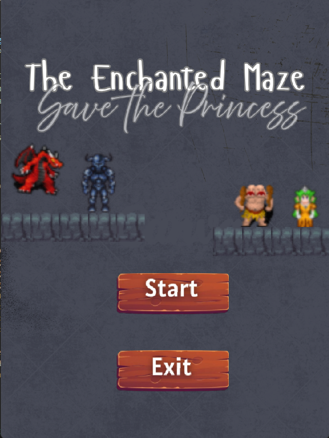
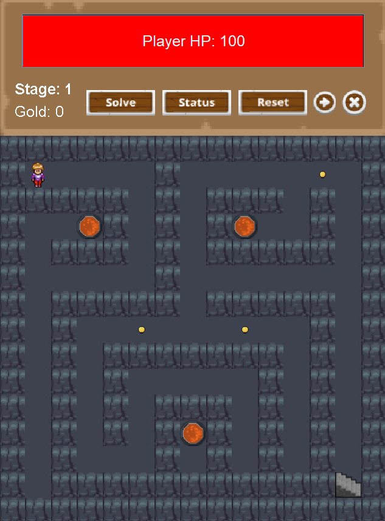
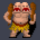
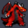
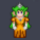
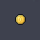
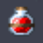
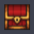

<h1 align="center"> Maze dengan Solver Menggunakan Algoritma Backtracking  </h1>

  
  

# How to play ?

  Gerakkan player dengan menggunakan W/A/S/D layaknya game pada umumnya disini terdapat beberapa tombol di header yakni solve untuk mencari solusi yang ada pada kondisi anda saat itu.
  Ada juga tombol reset untuk mengulang dari awal jika pemain mengalami jalan buntu saat menyelesaikan maze. Ada juga tombol skip stage untuk mempercepat demo saat presentasi.
  Ada juga tombol status agar player bisa melihat apakah dia menang saat bertemu dengan monster tersebut.

# Apa saja yang ada di game ?
<ul>
  <li><h3> Ada beberapa rintangan pada maze ini yaitu :</h3></li>
  

    

      
      
Plate Trap : jika player berada di posisi plate maka akan membuka sebuah pintu

    

    

      
      
Spike Trap : jika player melewati spike palyer akan terkena damage sebesar 3 

    

  

  <li><h3>Ada beberapa monster pada maze ini yaitu :</h3></li>
  

    

      
      
Spider : monster ini memiliki stats berupa hp = 200, atk = 5, def = 3

    

    

      
      
Ogre : monster ini memiliki stats berupa hp = 350, atk = 8, def = 5

    

    

      
      
Phoenix : monster ini memiliki stats berupa hp = 100, atk = 50, def = 0

    

    

      
      
Red Dragon : monster ini memiliki stats berupa hp = 1000, atk = 200, def = 35

    

  

  <li><h3>Ada beberapa objektif pada maze ini yaitu :</h3></li>
  

    

      
      
Untuk dapat meamatkan game ini kita harus bisa menyelamatkan princess yang ada di stage 5

    

    

      
      
Coin emas ini merupakan opsi bagi player ingin mengambilnya atau tidak

    

    

      
      
Player yang mendapatkan heal akan langsung penuh Hp nya

    

    

      
      
Player yang mendapatkan chest akan mendapatkan armor dan meningkatkan stats nya secara drastis

    

  

</ul>

# Bagaimana Algoritma Backtracking Bekerja ?

