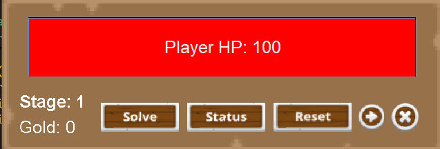

<h1 align="center"> Maze dengan Solver Menggunakan Algoritma Backtracking  </h1>

<div align="center">
  
  
</div>

# How to play ?
<div align="center">
  
  <p>
    Gerakkan player dengan menggunakan W/A/S/D layaknya game pada umumnya disini terdapat beberapa tombol di header yakni solve untuk mencari solusi yang ada pada kondisi anda saat itu.
    Ada juga tombol reset untuk mengulang dari awal jika pemain mengalami jalan buntu saat menyelesaikan maze. Ada juga tombol skip stage untuk mempercepat demo saat presentasi.
    Ada juga tombol status agar player bisa melihat apakah dia menang saat bertemu dengan monster tersebut. Di atas juga dilengkapi dengan jumlah gold, stage, dan HP dari 
    player untuk mempermudah pemain mevisualisasikannya
  </p>
</div>
<br/>

# Apa saja yang ada di game ?
<ul>
  <li><h3> Ada beberapa rintangan pada maze ini yaitu :</h3></li>
  <hr/>
    <div align="center">
      
      <p>Plate Trap : jika player berada di posisi plate maka akan membuka sebuah pintu</p>
    </div>
    <div align="center">
      
      <p>Spike Trap : jika player melewati spike palyer akan terkena damage sebesar 3 </p>
    </div>
  <hr/>
  <li><h3>Ada beberapa monster pada maze ini yaitu :</h3></li>
  <hr/>
    <div align="center">
      
      <p>Spider : monster ini memiliki stats berupa hp = 200, atk = 5, def = 3</p>
    </div>
    <div align="center">
      
      <p>Ogre : monster ini memiliki stats berupa hp = 350, atk = 8, def = 5</p>
    </div>
    <div align="center">
      
      <p>Phoenix : monster ini memiliki stats berupa hp = 100, atk = 50, def = 0</p>
    </div>
    <div align="center">
      
      <p>Red Dragon : monster ini memiliki stats berupa hp = 1000, atk = 200, def = 35</p>
    </div>
  <hr/>
  <li><h3>Ada beberapa objektif pada maze ini yaitu :</h3></li>
  <hr/>
    <div align="center">
      
      <p>Untuk dapat meamatkan game ini kita harus bisa menyelamatkan princess yang ada di stage 5</p>
    </div>
    <div align="center">
      
      <p>Coin emas ini merupakan opsi bagi player ingin mengambilnya atau tidak</p>
    </div>
    <div align="center">
      
      <p>Player yang mendapatkan heal akan langsung penuh Hp nya</p>
    </div>
    <div align="center">
      
      <p>Player yang mendapatkan chest akan mendapatkan armor dan meningkatkan stats nya secara drastis</p>
    </div>
  <hr/>
</ul>

# Bagaimana Cara Player Bergerak dan Pengecekannya ?
```java
  public void move(int map[][], Player player, int direction, ArrayList<Plate> keys, ArrayList<Monster> monsters,
            boolean isSolving) {
        switch (direction) {
            case 0: // up
                movePlayer(map, player, keys, monsters, isSolving, 0, -1);
                break;
            case 1: // down
                movePlayer(map, player, keys, monsters, isSolving, 0, 1);
                break;
            case 2: // left
                movePlayer(map, player, keys, monsters, isSolving, -1, 0);
                break;
            case 3: // right
                movePlayer(map, player, keys, monsters, isSolving, 1, 0);
                break;
        }
    }

    public void clearTrace(int[][] map) {
        for (int i = 0; i < gp.MAX_WORLD_ROW; i++) {
            for (int j = 0; j < gp.MAX_WORLD_COL; j++) {
                if (map[i][j] == 4 || map[i][j] == 3) {
                    map[i][j] = 6;
                }
            }
        }
    }

    public void movePlayer(int[][] map, Player player, ArrayList<Plate> keys, ArrayList<Monster> monsters,
            boolean isSolving, int dx, int dy) {
        int trace = (isSolving) ? 4 : 6; // Set trace tile based on solving state
        if (map[player.playerX + dx][player.playerY + dy] == 2) {
            if (!isSolving) {
                gp.hpTemp = player.playerHp;
                player.playerX += dx;
                player.playerY += dy;
            } else {
                map[player.playerX][player.playerY] = player.playerTileNum;
                player.solved = true;
            }
        } else if (map[player.playerX + dx][player.playerY + dy] == 5) {
            map[player.playerX][player.playerY] = trace;
            player.playerX += dx;
            player.playerY += dy;
            map[player.playerX][player.playerY] = player.playerTileNum;
            int keyIndex = searchKey(keys);
            playMusic(7);
            if (keyIndex != -1) {
                keys.get(keyIndex).openPath(map);
                keys.remove(keyIndex);
            }
            if (isSolving) {
                clearTrace(map);
            }
        } else if (map[player.playerX + dx][player.playerY + dy] == 7
                || map[player.playerX + dx][player.playerY + dy] == 8
                || map[player.playerX + dx][player.playerY + dy] == 9
                || map[player.playerX + dx][player.playerY + dy] == 17) {
            Monster x = getId(monsters, player.playerX + dx, player.playerY + dy);
            System.out.println("You encountered a monster!" + x.nama);
            boolean win = winBattle(x);
            if (win) {
                map[player.playerX][player.playerY] = trace;
                player.playerX += dx;
                player.playerY += dy;
                map[player.playerX][player.playerY] = player.playerTileNum;
                if (!isSolving) {
                    resetTraps(map);
                }
            }
            if (player.playerHp < 0) {
                player.playerHp = 0;
            }
        } else if (map[player.playerX + dx][player.playerY + dy] == 11) {
            map[player.playerX][player.playerY] = trace;
            player.playerX += dx;
            player.playerY += dy;
            map[player.playerX][player.playerY] = player.playerTileNum;
            gold++;
            playMusic(1);
            if (isSolving) {
                clearTrace(map);
            }
            resetTraps(map);
        } else if (map[player.playerX + dx][player.playerY + dy] == 10) {
            if (!isSolving) {
                gp.hpTemp = player.playerHp;
                gp.tileM.changeMap(player);
                playMusic(6);
            } else {
                map[player.playerX][player.playerY] = player.playerTileNum;
                player.solved = true;
            }
        } else if (map[player.playerX + dx][player.playerY + dy] == 12) {
            Trap triggered = getIdTrap(gp.traps, player.playerX + dx, player.playerY + dy);
            if (triggered != null && !triggeredTraps.contains(triggered)) {
                triggeredTraps.add(triggered);
            }
            map[player.playerX][player.playerY] = trace;
            player.playerX += dx;
            player.playerY += dy;
            map[player.playerX][player.playerY] = player.playerTileNum;
            System.out.println("You stepped on a trap! " + trapDmg + " HP.");
            player.playerHp -= trapDmg;
            playMusic(2);
        } else if (map[player.playerX + dx][player.playerY + dy] == 16) {
            Potion potion = getIdPotion(gp.potions, player.playerX + dx, player.playerY + dy);
            potion.healPlayer(player);
            map[player.playerX][player.playerY] = trace;
            player.playerX += dx;
            player.playerY += dy;
            clearTrace(map);
            map[player.playerX][player.playerY] = player.playerTileNum;
            System.out.println("You found a potion!");
            playMusic(10);
        } else if (map[player.playerX + dx][player.playerY + dy] == 14) {
            map[player.playerX][player.playerY] = trace;
            map[player.playerX + dx][player.playerY + dy] = 15;
            player.playerX += dx;
            player.playerY += dy;
            System.out.println("You found a chest ! ");
            isOpenChest = true;
            clearTrace(map);
            gp.tileM.transform(player);
            resetTraps(map);
        } else if (map[player.playerX + dx][player.playerY + dy] != 1
                && map[player.playerX + dx][player.playerY + dy] != 4
                && map[player.playerX + dx][player.playerY + dy] != 2) {
            map[player.playerX][player.playerY] = trace;
            player.playerX += dx;
            player.playerY += dy;
            map[player.playerX][player.playerY] = player.playerTileNum;
            if (!isSolving) {
                resetTraps(map);
            }
        }
    }
```
<div align="center">
  <div align="left">
    
## 🕹️ Move Player

### 🔧 Method: `public void move`

```java
public void move(int map[][], Player player, int direction, ArrayList<Plate> keys, ArrayList<Monster> monsters,
                 boolean isSolving) {
    switch (direction) {
        case 0: // up
            movePlayer(map, player, keys, monsters, isSolving, 0, -1);
            break;
        case 1: // down
            movePlayer(map, player, keys, monsters, isSolving, 0, 1);
            break;
        case 2: // left
            movePlayer(map, player, keys, monsters, isSolving, -1, 0);
            break;
        case 3: // right
            movePlayer(map, player, keys, monsters, isSolving, 1, 0);
            break;
    }
}
```
> **Method move() adalah sebuah prosedur yang digunakan untuk menentukan perpindahan koordinat x dan y berdasarkan arah yang diberikan melalui parameter direction.
Fungsi ini akan meneruskan data tersebut ke method movePlayer() untuk diproses lebih lanjut.**
 ### 🎯 Nilai direction dan Pergerakannya:
  - 0 → Atas: x tetap, y = y - 1
  - 1 → Bawah: x tetap, y = y + 1
  - 2 → Kiri: x = x - 1, y tetap
  - 3 → Kanan: x = x + 1, y tetap 
 ### 📥 Parameter yang Dipass ke movePlayer():
  - map: Matriks 2D yang mewakili peta permainan
  - player: Objek pemain
  - keys: Daftar Plate di dalam peta
  - monsters: Daftar monster
  - isSolving: Boolean penanda apakah pergerakan ini digunakan dalam proses backtracking 

### 🔧 Method: `public void clearTrace`
``` java
    public void clearTrace(int[][] map) {
        for (int i = 0; i < gp.MAX_WORLD_ROW; i++) {
            for (int j = 0; j < gp.MAX_WORLD_COL; j++) {
                if (map[i][j] == 4 || map[i][j] == 3) {
                    map[i][j] = 6;
                }
            }
        }
    }

```
Method ini berfungsi untuk membersihkan jejak-jejak yang telah dilalui pada peta. jejak yang dimaksud ini adalah representasi posisi atau lintasan yang pernah dilewati selama proses backtracking. Dengan mengganti nilai-nilai tersebut menjadi 6, method ini menghilangkan semua jejak yang pernah dilalui, termasuk posisi saat ini, sehingga pada backtracking dapat berjalan kembali ke track sebenarnya. Metode ini penting untuk solusi yang mengutamakan kriteria tertentu atau saat terdapat item yang telah ditemukan, contohnya adalah pada pengambilan plate, chest, potion, dll.


### 🔧 Method: `public void movePlayer`

### 👣 Menentukan trace yang akan digunakan saat player bergerak
```java
  int trace = (isSolving) ? 4 : 6; // Set trace tile based on solving state
```
Secara visual, tile 4 dan tile 6 menggunakan gambar yang sama. Namun, keduanya memiliki peran yang berbeda tergantung mode permainan.
- Saat mode adalah solve (sedang menjalankan backtracking), tile 4 digunakan untuk menandai jalur yang sudah pernah dilalui oleh algoritma backtracking.
- Sedangkan saat mode adalah free mode (mode bebas), tile 6 digunakan untuk menandai jalur yang sudah dilalui pemain.
Perbedaannya terletak pada logika backtracking itu sendiri. Pada backtracking, tile 4 menandai jalur yang tidak bisa dilalui lagi karena prinsipnya jalur tersebut sudah dieksplorasi dan dianggap dead end. Sementara itu, tile 6 di free mode tidak memiliki pembatasan tersebut karena jalur tersebut masih bisa dilalui.
Backtracking pada program ini dimulai dari posisi tombol solve ditekan sampai algoritma menemukan solusi, sehingga tile 4 membantu algoritma menandai jalur yang sudah diperiksa agar tidak kembali lagi ke titik yang sama.


#### 👸 Pengecekan apabila tujuan move player adalah princess
```java
        if (map[player.playerX + dx][player.playerY + dy] == 2) {
            if (!isSolving) {
                gp.hpTemp = player.playerHp;
                player.playerX += dx;
                player.playerY += dy;
            } else {
                map[player.playerX][player.playerY] = player.playerTileNum;
                player.solved = true;
            }
        }
```
jika move selanjutnya berakibat mempertemukan player dengan princess maka pilihan nya adalah : 
- jika free mode
  - menyimpan hp player saat ini ke sebuah variabel temporary agar jika player memilih untuk restart maka hp akan tetap sama dengan saat player masuk ke stage tersebut
  - Memidahkan posisi player
- jika mode saat ini mode solve
  - player tidak akan bergerak dan mode solve akan menemukan solusi agar saat di implementkan player akan berada di depan princess persis 
### 🗝️ Pengecekan Apabila tujuan adalah plate/key
``` java
        else if (map[player.playerX + dx][player.playerY + dy] == 5) {
            map[player.playerX][player.playerY] = trace;
            player.playerX += dx;
            player.playerY += dy;
            map[player.playerX][player.playerY] = player.playerTileNum;
            int keyIndex = searchKey(keys);
            playMusic(7);
            if (keyIndex != -1) {
                keys.get(keyIndex).openPath(map);
                keys.remove(keyIndex);
            }
            if (isSolving) {
                clearTrace(map);
            }
        }
```
Jika player bertemu dengan plate/key maka :
- player akan bergerak, dan meninggalkan jejak pada posisi sekaran
- akan mencari index key pada arraylist dengan menggunakan function searchKey yang mengembalikan index dari key pada posisi player saat ini
- jika index key ditemukan maka key akan di hilangkan dari map dan juga akan membuka sebuah jalur baru 

### 👺 Pengecekan Apabila Bertemu dengan monster
``` java
        else if (map[player.playerX + dx][player.playerY + dy] == 7
                || map[player.playerX + dx][player.playerY + dy] == 8
                || map[player.playerX + dx][player.playerY + dy] == 9
                || map[player.playerX + dx][player.playerY + dy] == 17) {
            Monster x = getId(monsters, player.playerX + dx, player.playerY + dy);
            System.out.println("You encountered a monster!" + x.nama);
            boolean win = winBattle(x);
            if (win) {
                map[player.playerX][player.playerY] = trace;
                player.playerX += dx;
                player.playerY += dy;
                map[player.playerX][player.playerY] = player.playerTileNum;
                if (!isSolving) {
                    resetTraps(map);
                }
            }
            if (player.playerHp < 0) {
                player.playerHp = 0;
            }
        } 

```

jika player encounter dengan monster maka pertama player akan mencari monster apakah itu dengan mencari monster yang memiliki posisi sama dengan player dan melakukan battle dengan monster tersebut jika player menang maka player akan bergerak ke posisi monster dan posisi sekarang menjadi trace tetapi jika tidak maka akan kembali ke main menu dan jika mode = free maka semua traps akan di reset melalui method resetTraps (traps dapat dilalui berulang kali meskipun telah dilalui)

> 🎮 Kriteria Battle melawan monster :
> selama player dan monster masih memiliki hp
> Player akan memberi damage kepada monster sesuai perhitungan (player attack - monster defense)
> monster akan memberi player damage sesuai dengan attack dari monster

### Pengecekan

```java
        else if (map[player.playerX + dx][player.playerY + dy] == 11) {
            map[player.playerX][player.playerY] = trace;
            player.playerX += dx;
            player.playerY += dy;
            map[player.playerX][player.playerY] = player.playerTileNum;
            gold++;
            playMusic(1);
            if (isSolving) {
                clearTrace(map);
            }
            resetTraps(map);
        } 
```
  
  </div>
</div>

# Bagaimana Algoritma Backtracking Bekerja ?
```java
  public void solve(int map[][], Player player, ArrayList<Plate> Plates, ArrayList<Monster> monsters, int path,
            int gold) {
        int[][] currentMapArr = new int[MAX_WORLD_COL][MAX_WORLD_ROW];
        if (player.solved) { // Jika sudah sampai tujuan
            System.out.println("=== Path found! ===");
            System.out.println("Current Map: " + currentMap);
            System.out.println("Player HP: " + player.playerHp);
            System.out.println("Player Gold: " + player.gold);
            System.out.println("Path: " + path);
            draw(map);
            copyMap(currentMapArr, map);
            solutions.add(new Solution(currentMapArr, path, player.clone()));
            player.solved = false;
        } else if (solutions.size() > 500) { // iki buat batesi solusi soale kebanyakan jadine lama
            return;
        } else {
            if (map[player.playerX][player.playerY - 1] != 1 && map[player.playerX][player.playerY - 1] != 4
                    && player.playerHp > 0) { // Up
                Player playerClone = player.clone();
                ArrayList<Plate> PlatesClone = new ArrayList<>();
                ArrayList<Monster> monstersClone = new ArrayList<>();
                copyArrayListPlate(PlatesClone, Plates);
                copyArrayListMonster(monstersClone, monsters);
                copyMap(currentMapArr, map);
                playerClone.move(currentMapArr, playerClone, 0, PlatesClone, monstersClone, true);
                solve(currentMapArr, playerClone, PlatesClone, monstersClone, path + 1, playerClone.gold);
            }
            if (map[player.playerX][player.playerY + 1] != 1 && map[player.playerX][player.playerY + 1] != 4
                    && player.playerHp > 0) { // Down
                Player playerClone = player.clone();
                copyMap(currentMapArr, map);
                ArrayList<Plate> PlatesClone = new ArrayList<>();
                ArrayList<Monster> monstersClone = new ArrayList<>();
                copyArrayListPlate(PlatesClone, Plates);
                copyArrayListMonster(monstersClone, monsters);
                playerClone.move(currentMapArr, playerClone, 1, PlatesClone, monstersClone, true);
                solve(currentMapArr, playerClone, PlatesClone, monstersClone, path + 1, playerClone.gold);
            }
            if (map[player.playerX - 1][player.playerY] != 1 && map[player.playerX - 1][player.playerY] != 4
                    && player.playerHp > 0) { // Left
                Player playerClone = player.clone();
                copyMap(currentMapArr, map);
                ArrayList<Plate> PlatesClone = new ArrayList<>();
                ArrayList<Monster> monstersClone = new ArrayList<>();
                copyArrayListPlate(PlatesClone, Plates);
                copyArrayListMonster(monstersClone, monsters);
                playerClone.move(currentMapArr, playerClone, 2, PlatesClone, monstersClone, true);
                solve(currentMapArr, playerClone, PlatesClone, monstersClone, path + 1, playerClone.gold);
            }
            if (map[player.playerX + 1][player.playerY] != 1 && map[player.playerX + 1][player.playerY] != 4
                    && player.playerHp > 0) { // Right
                Player playerClone = player.clone();
                copyMap(currentMapArr, map);
                ArrayList<Plate> PlatesClone = new ArrayList<>();
                ArrayList<Monster> monstersClone = new ArrayList<>();
                copyArrayListPlate(PlatesClone, Plates);
                copyArrayListMonster(monstersClone, monsters);
                playerClone.move(currentMapArr, playerClone, 3, PlatesClone, monstersClone, true);
                solve(currentMapArr, playerClone, PlatesClone, monstersClone, path + 1, playerClone.gold);
            }
        }
    }

```

### 🧠 Flowchart dari Bakctracking 
<pre><code>
+-----------------------------+
|      solve(map, ...)        |
+-----------------------------+
              |
              v
 +-----------------------------+
 |  Apakah player.solved?      |
 +-----------------------------+
        | Ya        | Tidak
        v           v
+----------------+  +--------------------------------------+
| Tambah solusi  |  | Apakah jumlah solusi > 500?          |
| ke daftar      |  +--------------------------------------+
| (solutions)    |           | Ya         | Tidak
+----------------+           |            v
       |                     |   +-------------------------+
       v                     |   | Cek arah Up bisa jalan? |
     [END]                   |   +-------------------------+
                             |           | Ya
                             |           v
                             |   - Clone Player, Map, dll
                             |   - Panggil solve() rekursif
                             |
                             |   +--------------------------+
                             |   | Cek arah Down bisa jalan?|
                             |   +--------------------------+
                             |           | Ya
                             |           v
                             |   - Clone Player, Map, dll
                             |   - Panggil solve() rekursif
                             |
                             |   +--------------------------+
                             |   | Cek arah Left bisa jalan?|
                             |   +--------------------------+
                             |           | Ya
                             |           v
                             |   - Clone Player, Map, dll
                             |   - Panggil solve() rekursif
                             |
                             |   +---------------------------+
                             |   | Cek arah Right bisa jalan?|
                             |   +---------------------------+
                             |           | Ya
                             |           v
                             |   - Clone Player, Map, dll
                             |   - Panggil solve() rekursif
                             |
                             v
                           [END]
</code></pre>

### ❓Cara Kerja :
1. Cek apakah map yang dilempar dalam fungsi rekursif sudah sampai di garis finish atau belum. <br/>
2. Cek terlebih dahulu apakah jumlah solusi yang sudah disimpan jumlah nya < 500 karena untuk mempersingkat lamanya backtracking saat demo. <br/>
3. Coba bergerak ke 4 arah berbeda yaitu atas, bawah, kiri, dan kanan pada saat proses ini jejak yang dtinggalkan atau jejak yang sudah dilewati player tidak bisa dilewati lagi. <br/>
4. Sebelum menggerakkan posisi player jangan lupa untuk mengcloning player dan map karena kita harus menghindari adanya Pass By Reff agar rekursif tidak terganggu. <br/>
5. Dalam kasus ini jejak yang ditinggalkan player akan dihapus setelah player menemukan objektif seperti gold, plate, atau heal sehingga saat player mendapatkan objektif tidak berhenti. <br/> 


